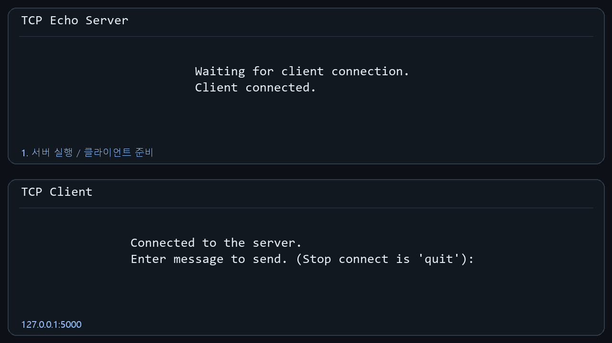
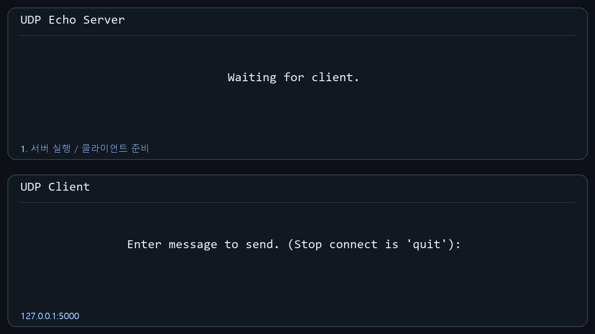
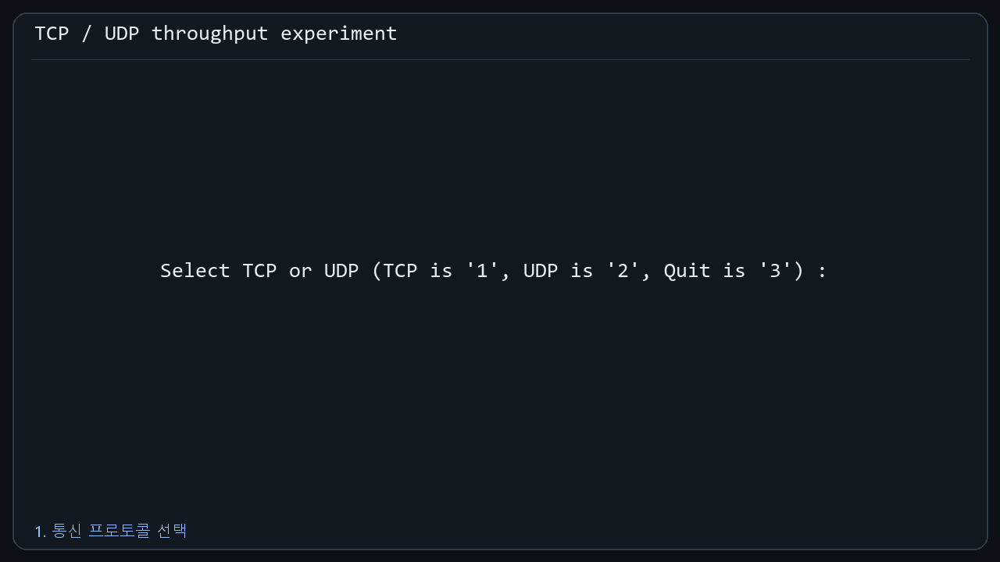
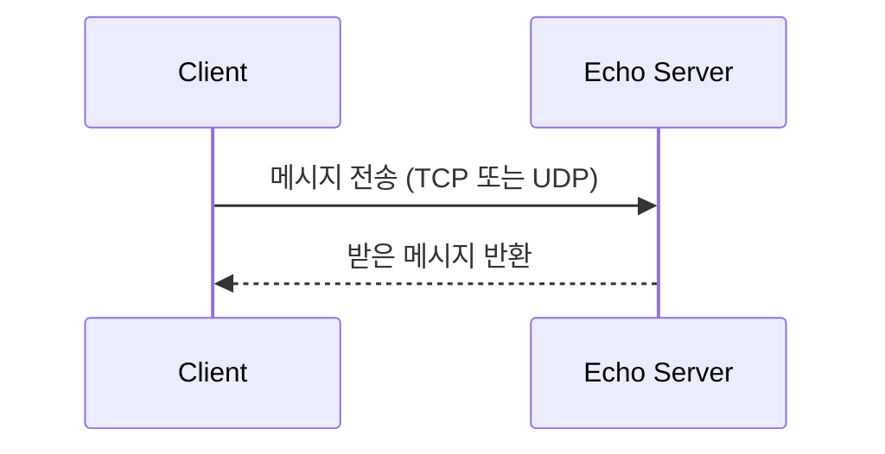

<a id="project-overview-added"></a>

[프로젝트 안내](#project-overview-added) · [기존 README 전체 내용](#original-readme-preserved)

# TCP / UDP Socket Programming in C

**Windows Winsock으로 TCP·UDP 에코 통신과 전송 속도 비교 실험을 구현한 네트워크 프로그래밍 과제입니다.**

서버·클라이언트의 소켓 생성부터 데이터 송수신까지 구현하고, 지연·손실 조건에 따른 결과를 보고서로 정리했습니다.

`C` · `Winsock2` · `GCC` · `GNU Make` · `Clumsy`

[실험 과정·결과](#original-readme-preserved) · [제출 보고서 PDF](docs/보고서.pdf) · [소스 모음](sources)

## 실제 실행 GIF

원본 C 소스를 Windows에서 컴파일해 서버와 클라이언트를 실행했습니다. 아래 GIF는 실제 콘솔 출력을 16:9 프레임에 배치한 데모입니다.

### TCP 에코 통신



서버 실행 → 클라이언트 연결 → 메시지 전송 → 에코 응답 → `quit` 종료 흐름입니다.

### UDP 에코 통신



데이터그램 전송과 서버의 응답을 확인할 수 있습니다.

### 전송 속도 실험



TCP 500 bytes/sec와 UDP 1,000 bytes/sec를 선택해 각각 5초 동안 전송한 로컬 실행 예시입니다. 화면의 수치는 해당 실행에서 프로그램이 출력한 값입니다.

[빌드·실행 환경](docs/demo-capture.md)

## 구현 구성

| 프로그램 | 역할 |
| --- | --- |
| `TCP_echo_server.c` / `TCP_client.c` | 연결형 TCP 에코 통신 |
| `UDP_echo_server.c` / `UDP_client.c` | 데이터그램 UDP 에코 통신 |
| `TCP_UDP_server.c` / `TCP_UDP_client.c` | TCP·UDP 선택 및 전송 속도 실험 |



## 빌드

Windows에서 MinGW GCC와 GNU Make를 사용합니다. Winsock 라이브러리 `ws2_32`가 링크되며, `sources/Makefile`의 정리 명령은 Windows용입니다.

```powershell
git clone https://github.com/unknownamed/Basic-TCP-and-UDP-Implementation.git
cd Basic-TCP-and-UDP-Implementation/sources
make
```

개별 빌드 예시:

```powershell
gcc -Wall TCP_echo_server.c -o TCP_echo_server.exe -lws2_32
gcc -Wall TCP_client.c -o TCP_client.exe -lws2_32
```

## 실행

서버를 먼저 실행하고, 다른 터미널에서 대응하는 클라이언트를 실행합니다. 기본 연결 대상은 `127.0.0.1:5000`입니다.

```powershell
# 터미널 1
.\TCP_echo_server.exe
```

```powershell
# 터미널 2
.\TCP_client.exe
```

UDP 실험은 `UDP_echo_server.exe`와 `UDP_client.exe`로 실행합니다. 클라이언트에서 메시지를 입력하면 에코 응답을 확인할 수 있으며 `quit`으로 종료합니다. 같은 포트를 사용하는 실험은 서버를 종료한 뒤 다음 실험을 시작합니다.

## 전송 속도 비교

`TCP_UDP_server.exe` 실행 후 `TCP_UDP_client.exe`의 메뉴에서 프로토콜과 전송 속도를 선택합니다.

- 전송 속도: 500 / 1,000 / 2,000 bytes/sec
- 전송 시간: 5초
- 보고서의 비교 조건: 기본 환경 및 Clumsy를 통한 지연·손실 환경

실험에서는 뚜렷한 성능 차이가 관찰되지 않은 조건도 있습니다. 상세 설정과 측정값은 [기존 실험 보고서](#original-readme-preserved)에 정리되어 있으며, 측정 결과를 다른 네트워크 환경에 그대로 일반화하지 않습니다.

---

<a id="original-readme-preserved"></a>

## 기존 README 전체 내용

# < HW01 과제 보고서 >

**학번** : 20223149
**이름** : 황대겸

### 보고서 목차

✓ 1-1. TCP 기반 서버/클라이언트 프로그램의 기능 검증 및 검증 환경

1-2. UDP 서버 및 클라이언트 프로그램을 작성했을 때, TCP 기반 프로그램과의 차이점

✓ 실행 결과 1) RTT 100ms, 패킷 손실률 1%

✓ 실행 결과 2) RTT 100ms, 패킷 손실률 0.1%

2-1. 전송 속도 변화에 따른 클라이언트와 서버 간 throughput 측정 및 변화와 이에 드러나는 TCP와 UDP 간 차이점

2-2. 패킷 손실률 변화에 따른 클라이언트와 서버 간 throughput 측정 및 변화와 이에 드러나는 TCP와 UDP 간 차이점

---

### TCP 및 UDP 클라이언트/서버 실행 결과

**TCP 클라이언트 실행 결과)**

C:\Users\user\Desktop\수업 \202601\네트워크 프로그래밍\soket_programming>TCP_client
Connected to the server.

Enter message to send. (Stop connect is 'quit'): hi
Received from server: hi

Enter message to send. (Stop connect is 'quit'): hello
Received from server: hello

Enter message to send. (Stop connect is 'quit'): quit

**서버(TCP) 측 실행 결과)**

C:\Users\user\Desktop\수업\202601\네트워크 프로그래밍\soket_programming>TCP_echo_server
Waiting for client connection.
Client connected.
Received from client: hi
Received from client: hello
Waiting for client connection.

**UDP 클라이언트 실행 결과)**

C:\Users\user\Desktop\\202601\네트워크 프로그래밍\soket_programming>UDP_client
Enter message to send.
hello
Received from server: hello

Enter message to send.
hi
Received from server: hi

Enter message to send.
quit

**UDP 에코 서버 실행 결과)**

C:\Users\user\Desktop\수업 \202601\네트워크 프로그래밍\soket_programming>UDP_echo_server
Waiting for client.
Received from client: hello
Waiting for client.
Received from client : hỉ
Waiting for client.
Waiting for client.

---

### 1-1. TCP 기반 서버/클라이언트 프로그램의 기능 검증 및 검증 환경

**검증 환경)**

운영체제 Window 11에서 Visual Studio Code의 내부 터미널 창 2개에 각각 TCP 에코서버와 TCP 클라이언트를 실행하여 테스트를 진행하였음.

Makefile을 활용 빌드함. Makefile 내부에 윈도우 소켓 라이브러리를 링크 옵션으로 넣음(make, make clean 윈도우에서만 가능).

**기능 검증)**

서버가 클라이언트에게 받는 문자열을 printf() 함수를 활용하여 표시하게 하여 클라이언트 측에서 입력한 데이터와 서버측에 뜨는 데이터를 눈으로 확인하여 정확히 전달되었음을 확인했고 서버 측에서 보내는 데이터가 보내지는 지에 대해서도 에코서버로 만들어 다시 클라이언트측에서 확인하도록 하여 데이터의 통신이 양방향으로 이루어짐을 확인하였음.

클라이언트가 접속할 서버의 IP의 경우 127.0.0.1을 활용하였고 가독성 향상을 위해 이미 define되어있는 상수로 INADDR_LOOPBACK을 활용해 루프백 주소임을 명시함.

루프백 주소를 사용한 이유는 Visual Studio Code내에서 터미널을 2개를 띄워 하나의 컴퓨터 내부에서 통신하였기 때문에 사용하였음.

포트 번호의 경우 Well-Known Ports라는 이미 용도가 정해져있는 포트 번호를 피해서 1023번까지를 제외한 나머지 포트중에서 5000을 선택함.

---

### 1-2. UDP 서버 및 클라이언트 프로그램을 작성했을 때, TCP 기반 프로그램과의 차이점

**차이점)**

UDP의 경우, TCP와 달리 연결 과정이 없기 때문에 코드상 구현에서도 서버의 경우 bind()로 소켓을 허용할 IP와 포트번호를 지정하여 열어 놓는 것은 동일하다.

하지만 TCP의 경우 따로 클라이언트에게 connect()요청을 받아서 서버쪽에서 accept()하여 해당 클라이언트와의 통신용 소켓을 따로 만드는 반면에, UDP의 경우는 recv대신에 recvfrom를 사용하여 요청과 함께 해당 클라이언트의 주소를 같이 받는 인자가 있어 이를 저장해 두었다가 send대신에 sendto를 활용해 recvfrom()에서 받은 클라이언트의 주소값을 sendto에 넣어보낸다.

즉 따로 통신용 소켓을 만들지 않고 보내며, 따로 통신용 소켓을 만들지 않기 때문에 매번 보낼 때마다 해당 주소와 포트번호를 지정해줘야한다.

---

### 실행 결과 1) RTT 100ms, 패킷 손실률 1%

Started filtering. Enable functionalities to take effect.
Clumsy <RTT 100ms, 패킷 손실률 1%> 실행 결과)

**<TCP 전송 결과, throuput>**

TCP throuput: 493.485985 byte/sec (전송 속도 500bytes/sec 기준 클라이언트 측정)
TCP throuput: 495.547200 byte/sec (서버 측 측정)

TCP throuput: 992.851469 byte/sec (전송 속도 1000bytes/sec 기준 클라이언트 측정)
TCP throuput: 996.217400 byte/sec (서버 측 측정)

TCP throuput: 1984.126984 byte/sec (전송 속도 2000bytes/sec 기준 클라이언트 측정)
TCP throuput: 1996.009577 byte/sec (서버 측 측정)

**<UDP 전송 결과, throuput>**

UDP throuput: 494.951495 byte/sec (전송 속도 500bytes/sec 기준 클라이언트 측정)
UDP throuput: 496.726840 byte/sec (서버 측 측정)

UDP throuput: 989.119683 byte/sec (전송 속도 1000bytes/sec 기준 클라이언트 측정)
UDP throuput: 989.715190 byte/sec (서버 측 측정)

UDP throuput: 1982.553529 byte/sec (전송 속도 2000bytes/sec 기준 클라이언트 측정)
UDP throuput: 1977.465902 byte/sec (서버 측 측정)

---

### 실행 결과 2) RTT 100ms, 패킷 손실률 0.1%

Started filtering. Enable functionalities to take effect.
Clumsy <RTT 100ms, 패킷 손실률 0.1%> 실행 결과)

**<TCP 전송 결과, throuput>**

TCP throuput: 494.853523 byte/sec (전송 속도 500bytes/sec 기준 클라이언트 측정)
TCP throuput: 496.628322 byte/sec (서버 측 측정)

TCP throuput: 995.024876 byte/sec (전송 속도 1000bytes/sec 기준 클라이언트 측정)
TCP throuput: 995.424707 byte/sec (서버 측 측정)

TCP throuput: 1978.239367 byte/sec (전송 속도 2000bytes/sec 기준 클라이언트 측정)
TCP throuput: 1983.739837 byte/sec (서버 측 측정)

**<UDP 전송 결과, throuput>**

UDP throuput: 497.512438 byte/sec (전송 속도 500bytes/sec 기준 클라이언트 측정)
UDP throuput: 498.705437 byte/sec (서버 측 측정)

UDP throuput: 995.024876 byte/sec (전송 속도 1000bytes/sec 기준 클라이언트 측정)
UDP throuput: 988.542078 byte/sec (서버 측 측정)

UDP throuput: 1978.630787 byte/sec (전송 속도 2000bytes/sec 기준 클라이언트 측정)
UDP throuput: 1980.597901 byte/sec (서버 측 측정)

---

### 2-1. 전송 속도 변화에 따른 클라이언트와 서버 간 throughput 측정 및 변화와 이에 드러나는 TCP와 UDP 간 차이점

**전송 속도 변화에 따른 클라이언트와 서버 간 throughput 측정 변화)**

전송 속도를 500, 1000, 2000 bytes/sec로 증가시킨 결과, TCP와 UDP 모두 측정된 throughput 수치가 전송 속도에 비례하여 상승함.

실제로 네트워크 에뮬레이터인 Clumsy를 활용해 RTT 100ms로하고, 패킷 손실률을 1%로 설정한 환경에서 TCP 클라이언트의 throughput은 493.48 byte/sec, 992.85 byte/sec, 1984.12 byte/sec 정도로 측정되어 송신 속도에 맞춰 증가하였음.

또한 UDP 클라이언트의 throughput 역시 494.95 byte/sec, 989.11 byte/sec. 1982.55 byte/sec 정도로 TCP와 유사하게 전송 속도에 비례하여 증가함.

**TCP와 UDP 간 차이점)**

현재 throughput의 측정 값으로는 TCP와 UDP 간의 뚜렷한 차이점은 느끼지 못하겠음.

또한 매 실행 마다 값이 변동이 있어 어느 측정으로 두 프로토콜을 비교해야하는것인지 제대로 된것인지 확신이 서지 않음.

측정 결과에서는 뚜렷하게 나타나지 않았으나, 추측하자면, TCP는 재전송 과정이 있기 때문에 패킷 손실률이 큰 1%의 경우에 보내는 시간이 재전송에 의해 더 길어지지만, 데이터는 보존되는 비율이 높기 때문에, TCP의 경우 throughput이 시간인 분모가 커져 작아질것이고, UDP의 경우 연결 과정에 쓰이는 시간도 없고 재전송 되는 과정이 없기 때문에 대부분 일정할 것이며, 패킷 손실률이 큰 경우에만 보낸 데이터들이 사라져 총 받은 데이터의 양이 줄어 분자인 데이터가 작아져, throughput이 작아질 것이고 이는 시간 당 보내는 데이터의 양이 많아질수록 전송 속도에 비례해 그 차이가 커질 것이다.

---

### 2-2. 패킷 손실률 변화에 따른 클라이언트와 서버 간 throughput 측정 및 변화와 이에 드러나는 TCP와 UDP 간 차이점

**패킷 손실률 변화에 따른 클라이언트와 서버 간 throughput 측정 변화)**

현재 RTT 100ms인 동일한 네트워크 에뮬레이터를 실행한 환경에서 패킷 손실률이 1%인 경우와 0.1%인 경우를 비교하였을 때, 패킷 손실률 변화에 따른 뚜렷한 throughput 변화 수치는 발견하지 못함.

실제로 패킷 손실률의 변화를 가장 많이 받을 2000 bytes/sec 전송 속도를 기준으로 보면, 패킷 손실률 1%에서의 TCP 서버 throughput은 1996.00 byte/sec, UDP 서버 throughput은 1977.46 byte/sec로 측정됨. 또한, 패킷 손실률 0.1% 환경에서는 TCP 서버가 1983.73 byte/sec UDP 서버가 1980.59 byte/sec로 측정됨.

결과적으로 미미한 수준의 수치적 오차만 발생하며, 뚜렷한 throughput 저하는 관찰되지 않음.

**TCP와 UDP 간 차이점)**

현재 throughput의 측정 값으로는 TCP와 UDP 간의 뚜렷한 차이점은 느끼지 못하겠음.

또한 매 실행 마다 값이 변동이 있어 어느 측정으로 두 프로토콜을 비교해야하는것인지 제대로 된것인지 확신이 서지 않음.

이번의 측정 결과의 경우, 마지막으로 측정한 값을 보고서에 활용하였지만, 네트워크 에뮬레이터를 끄고 실행해보고, 네트워크 에뮬레이터 중 RTT만 설정하여 측정하고, 패킷 손실률만 1%, 0.1%로 설정하고 돌려 보았음.

이중 눈에 띄던 것은 전송 속도를 2000bytes로 했을 때, 클라이언트 측의 throughput 측정 결과에 비해 300bytes/sec 정도의 throughput이 낮게 측정되었던 서버측의 결과값임.

네트워크 에뮬레이터에서 패킷 손실률만 1% 설정한 UDP였음. 왜 이때만 다른 측정에서 10~20 정도에서 머물던 클라이언트 측의 측정값과 서버 측의 측정값의 오차가 컸는지는 모르겠지만, 해당 측정에서 오차가 뚜렸했던 이유는 UDP는 일방적으로 데이터를 보내고 TCP와 같이 재전송 과정이 없기 때문에 데이터의 손실이 일어나서 (총 데이터 / 총 걸린시간)에서 시간은 다른 결과에서 모두 비슷했던데에 비해, 총 데이터의 양이 적었기 때문에 UDP에서 눈에 띄는 오차가 생긴 것으로 추측함.