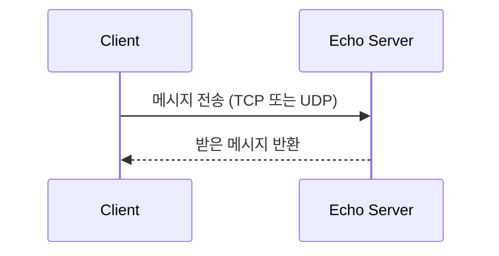

# TCP / UDP Socket Programming in C

**Windows Winsock으로 TCP·UDP 에코 통신과 전송 속도 비교 실험을 구현한 네트워크 프로그래밍 과제입니다.**

서버·클라이언트의 소켓 생성부터 데이터 송수신까지 구현하고, 지연·손실 조건에 따른 결과를 보고서로 정리했습니다.

`C` · `Winsock2` · `GCC` · `GNU Make` · `Clumsy`

[실험 과정·결과](docs/experiment-report.md) · [제출 보고서 PDF](docs/보고서.pdf) · [소스 모음](sources)

## 구현 구성

| 프로그램 | 역할 |
| --- | --- |
| `TCP_echo_server.c` / `TCP_client.c` | 연결형 TCP 에코 통신 |
| `UDP_echo_server.c` / `UDP_client.c` | 데이터그램 UDP 에코 통신 |
| `TCP_UDP_server.c` / `TCP_UDP_client.c` | TCP·UDP 선택 및 전송 속도 실험 |



## 빌드

Windows에서 MinGW GCC와 GNU Make를 사용합니다. Winsock 라이브러리 `ws2_32`가 링크되며, `sources/Makefile`의 정리 명령은 Windows용입니다.

```powershell
git clone https://github.com/unknownamed/Basic-TCP-and-UDP-Implementation.git
cd Basic-TCP-and-UDP-Implementation/sources
make
```

개별 빌드 예시:

```powershell
gcc -Wall TCP_echo_server.c -o TCP_echo_server.exe -lws2_32
gcc -Wall TCP_client.c -o TCP_client.exe -lws2_32
```

## 실행

서버를 먼저 실행하고, 다른 터미널에서 대응하는 클라이언트를 실행합니다. 기본 연결 대상은 `127.0.0.1:5000`입니다.

```powershell
# 터미널 1
.\TCP_echo_server.exe
```

```powershell
# 터미널 2
.\TCP_client.exe
```

UDP 실험은 `UDP_echo_server.exe`와 `UDP_client.exe`로 실행합니다. 클라이언트에서 메시지를 입력하면 에코 응답을 확인할 수 있으며 `quit`으로 종료합니다. 같은 포트를 사용하는 실험은 서버를 종료한 뒤 다음 실험을 시작합니다.

## 전송 속도 비교

`TCP_UDP_server.exe` 실행 후 `TCP_UDP_client.exe`의 메뉴에서 프로토콜과 전송 속도를 선택합니다.

- 전송 속도: 500 / 1,000 / 2,000 bytes/sec
- 전송 시간: 5초
- 보고서의 비교 조건: 기본 환경 및 Clumsy를 통한 지연·손실 환경

실험에서는 뚜렷한 성능 차이가 관찰되지 않은 조건도 있습니다. 상세 설정과 측정값은 [기존 실험 보고서](docs/experiment-report.md)에 정리되어 있으며, 측정 결과를 다른 네트워크 환경에 그대로 일반화하지 않습니다.
